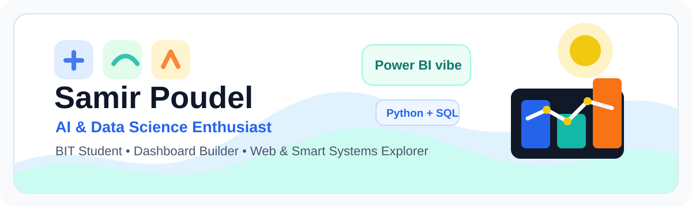
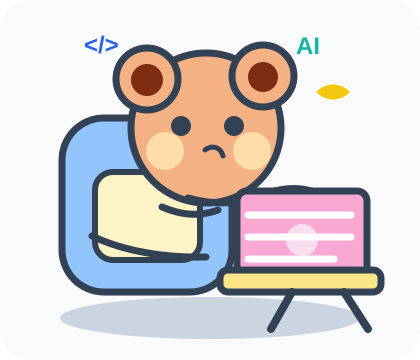
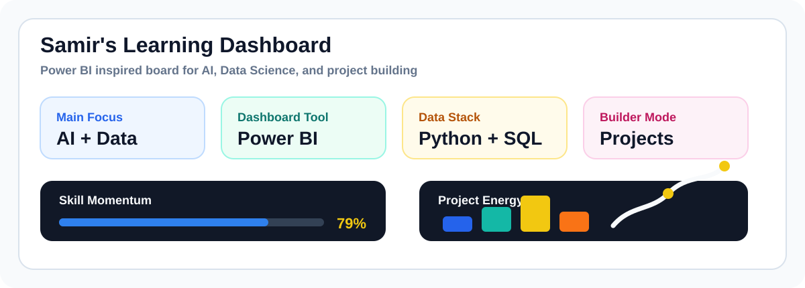

<div align="center">



<br />

[](https://git.io/typing-svg)

</div>

---

<table>
  <tr>
    <td width="58%" valign="top">
      <h2>Hi, I'm Samir Poudel 💻✨</h2>
      <p>
        I'm a <b>BIT student at Kantipur City College, Kathmandu</b> with a growing focus on
        <b>Artificial Intelligence, Data Science, dashboards, web apps, and smart systems</b>.
      </p>
      <p>
        I like building projects that are practical, visual, and useful: from medicine reminders
        and vaccination trackers to embedded systems and classic games. Right now, I am sharpening
        my skills in <b>Python, Power BI, SQL, web development, and AI fundamentals</b>.
      </p>
  </td>
  <td width="42%" align="center" valign="top">
    
  </td>
  </tr>
</table>

```python
samir = {
    "username": "Cr7samiee",
    "focus": ["AI", "Data Science", "Power BI", "Web Apps"],
    "learning": ["Python", "Machine Learning", "Dashboards", "SQL"],
    "style": "build first, learn deeper, improve every version",
    "open_to": ["Internships", "Collaborations", "Hackathons"]
}
```

---

## Data Dashboard

<div align="center">



</div>

---

## Tech Toolbox

<div align="center">

### AI, Data & Analytics


### Programming & Web


### Tools


</div>

---

## Featured Projects

| Project | Tech | What it shows |
|---|---|---|
| **MedTracker** | PHP, JS, API | Reminder system with real-time Email and SMS alerts |
| **Child Vaccination Tracker** | Java | Smart scheduler with automated reminders |
| **Smart Poultry Water Feeder** | Embedded C, 8051 | Practical automation for water management |
| **Space Impact Game** | Java | Game logic, collision handling, and enemy waves |
| **Tetris Game** | C++ + graphics.h | Score, movement, collision, and graphical rendering |
| **Hangman Game** | C | Console logic and clean beginner-friendly gameplay |

---

## GitHub Analytics

<div align="center">


<br />


</div>

---

## Connect

<div align="center">

[](https://www.linkedin.com/in/samir-poudel-2539312a0/)
[](mailto:cr7samiee33@gmail.com)
[](https://github.com/Cr7samiee)

</div>

<br />

<div align="center">


**Learning daily. Building visually. Growing into AI and Data Science.**

</div>
